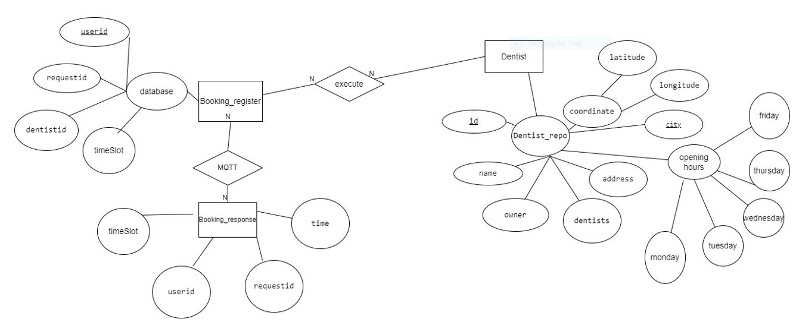
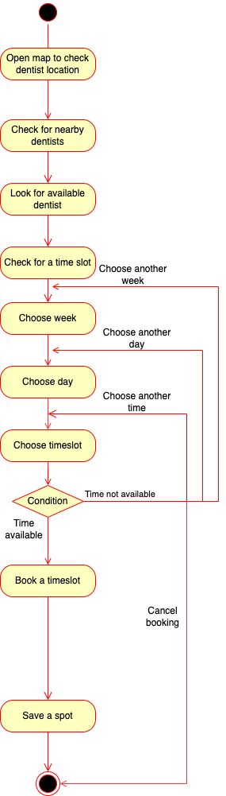
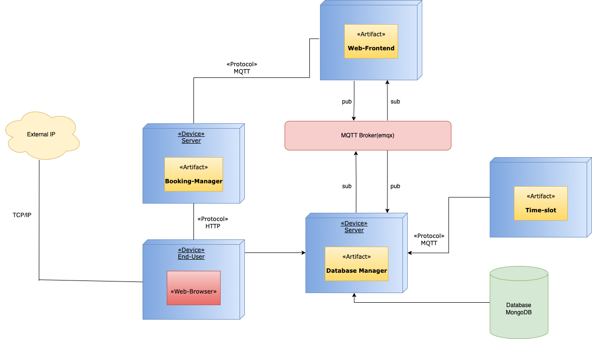
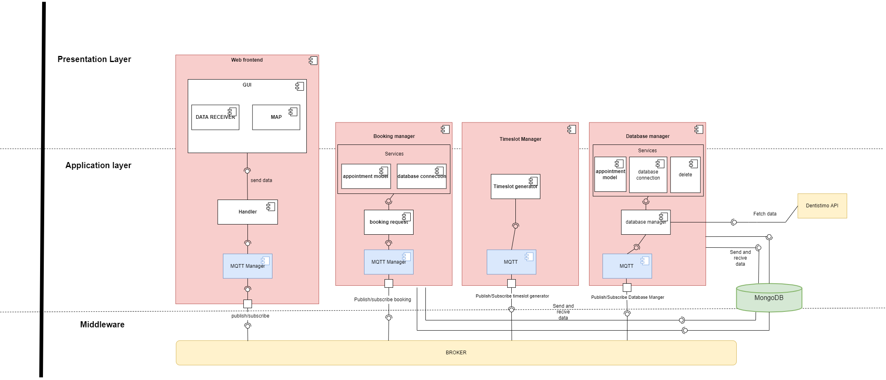

#  Group 15 - Documentation

#### Introduction

* In this project, we developed a web-application that used a distrubted system mechanism such as, publish & subscribe, event-driven and client & server. The system will allow the user to book any available dentist appointment at a chosen date.

#### Done By 
* Luai Obaid

#### Links

* [Trello Board]()
* [Front End]()
* [DS Backend]()

#### Get Started

1) Fist Clone the project's repository by SSH key below: 

* Web Frontend - git@git.chalmers.se:courses/dit355/test-teams-formation/team-15/web-frontend.git
* Database Manager - git@git.chalmers.se:courses/dit355/test-teams-formation/team-15/DS-DatabaseManager.git
* Timeslot Generator - git@git.chalmers.se:courses/dit355/test-teams-formation/team-15/timeslot-generator.git
* Booking Manager - git@git.chalmers.se:courses/dit355/test-teams-formation/team-15/bookingmanager.git
* For Testing purposes you can also also use our Request handler - git@git.chalmers.se:courses/dit355/test-teams-formation/team-15/requesthandler.git

2) After the chosen repository is cloned, go through README files for a detailed description on how to run the components.

#### Tech

* Node.js
* Vue.js
* MQTT Broker (emqx.io)
* GitLab
* Trello
* Discord
* VS Code
* MongoDB
* DrawIO

#### Diagrams
* Entity Diagram: 
* Activity Diagram: 
* Deployment Diagram: 
* Component Diagram: 

## Software Requirement Specification (SRS): 
#### WebGUI (Front End)
* FR1. The system shall allow the user to navigate through a map containing all dentists in Gothenburg.
* FR2. The system shall allow the user to book an appointment from the list of dentists.
* FR3. The system shall accomidate to any changes in the dentist repository and act accordingly. 

#### Backend
* FR1. The system shall allow the user to book an appointment.
* FR2. The system shall allow the user to see various dentistries.
* FR3. The system shall allow the user to choose the date and get  time slots accordingly. 
* FR4. The system shall save the booking informations in the database. 
* FR5. The system shall allow the user to get notifcation about the confirmed appointments. 
* FR6. The system shall allow the user to get notifcation about the rejected appointments.

## Explaining Every Component
* #### WebGUI
The WebGUI uses the **Publish/Subscribe** architectual style. The WebGUI acts as both the ***Publisher*** and ***Subscriber***. As soon as the component starts it subscribes to a topic that we discussed earlier. Pressing on the start button will publish a message to the ***Backend***, The ***backend*** will publish the JSON file containing all the dentist information to the frontend through the topic that we already subscribed to. The WebGUI stores the JSON file in the StoreJs to use it easier and also will make the website run faster as the info will be stored already. **STILL NEEDS WORK**. Upon chosing the desired time the WebGUI will publish the info to the topic that we aggreed upon before.

* #### Database manager
The databaseManager uses the **Publish/Subscribe** architectual style. The databaseManager acts as both the ***Publisher*** and ***Subscriber***. As soon as a user in the front subscribe to a topic. A Publish message will go to the ***databaseManager***, The ***databaseManager*** will fetch a json file and publish the JSON file containing all the dentist information to the frontend through the topic that we already subscribed to. ***databaseManager more to be added***

* ### timeslotsGenerator
The timeslotsGenerator uses the **Event driven** architectual style. The timeslotsGenerator is driven by the databaseManager and acts as both the ***Publisher*** and ***Subscriber***. This component subscribe the databaseManager and once receive the publish from the databaseManager, the timeslotsGenerator will start parse the time and stored it in to an array amd will publish the timeslots to the WebGUI. Besides, the weekday will be tag an id for the frontend to use

* ### bookingManager
The bookingManager uses the Event driven architectual style. The bookingManager is driven by the web-frontend and acts as Subscriber. This component subscribe the web-frontend and once receive the publish from the web-frontend, the bookingManager will start parsing the received request and call the mongoose function to store the parsed request to the appointment database.

#### Agile Methodologies 

**Sprint Planning**

-   Preparation (set period of time during which specific work has to be completed and made ready for review.  Decide what backlog items will be implemented in the upcoming sprint and tasks assigned to the development team. Items sorted according to priority.
 
**Daily Scrum**

-   We choose Friday as part of our daily meetings where everyone in the development team is available for status updates on the sprint items. Impediments or extra help discussed during the meeting.

**Sprint Retrospectives**

Making sure to agree on a Sprint Goal.

Refine the Product Backlog.

Plan the value that will be delivered.

**Sprint 1:**

What went well:

-   Good team coordination
-   Knowledge sharing from all team members
-   ER and component diagrams made for the project
-   POC for backend started
-   Basic Mqtt model made

What we plan to commit in the next sprint:

-   Basic frontend structure
-   Continue working on the POC for backend

What needs to be improved and are there any impediments:

-   Arranging 7 members for a meeting
-   Revise through lecture slides for clear concept

**Sprint 2:**

What went well:

-   Basic frontend structure is done
-   A working map is added to frontend
-   Scheduled meetings took place
-   Backend structure is done
-   Fetch data from JSON file
-   Good cooperation within team code along session.

What we plan to do in the next sprint:

-   make a skeleton Mqtt broker
-   Implement circuit breaker
-   Create a deployment diagram
-   Work on request handler
-   Connection of MQTT broker and the database to the databasemanager

What needs to be improved and are there any impediments:

-   Some problems of attending to the weekly meetings 
-   Pushing code more regularly

**Sprint 3:**

What went well:

-	Deployment Diagram is created
-	MQTT broker and database has a connection
-	Request handler
-	Documentation is extended
-	Higher attendance in the weekly meetings
-	Good cooperation within team code along session.

What we plan to do in the next sprint:

-	Work on booking manager
-	Create button showing available times
-	Work on certain features that left undone in this sprint (circuit breaker, connection between broker and backend

What needs to be improved and are there any impediments:

-	Certain features could not be completed due to complexity,

**Sprint 4:**

What went well:

-	Booking manager is implemented
-	Button is created to show available times
-	Booking methods are implemented
-	Timeslot generator implemented
-	Activity Diagram and Use case diagram created
-	Deployment Diagram is updated
-	Component diagram updated
-	Working bee to get impediments and deliverables completed

